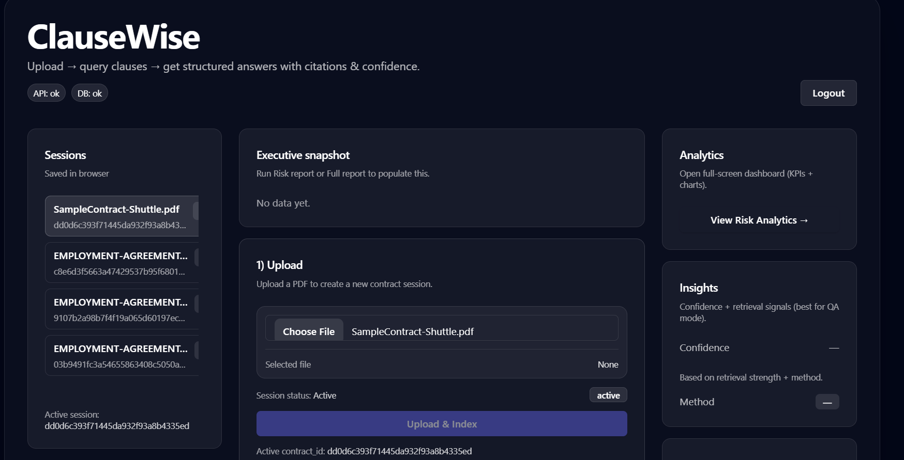
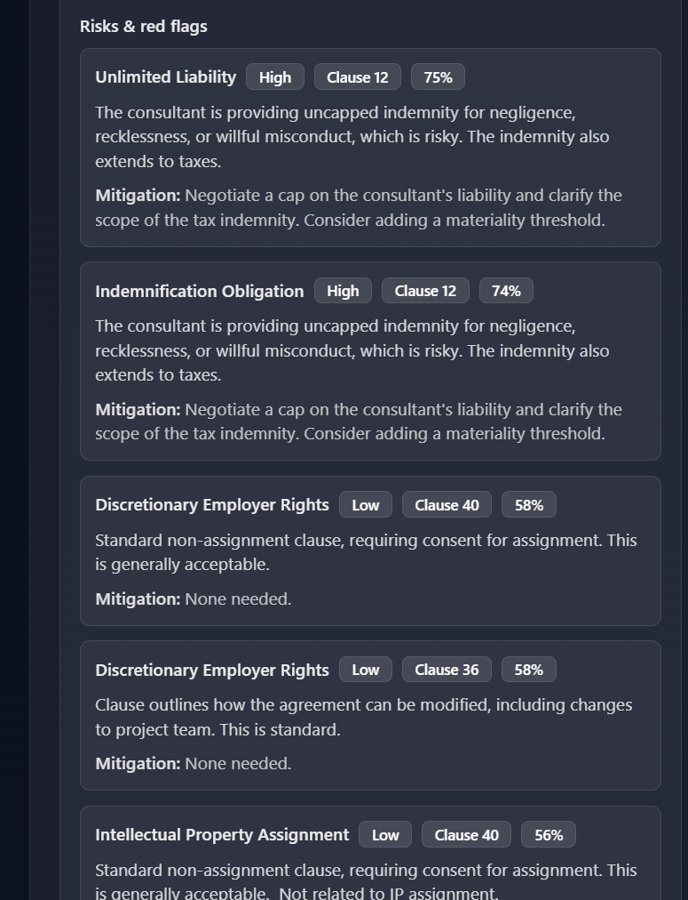
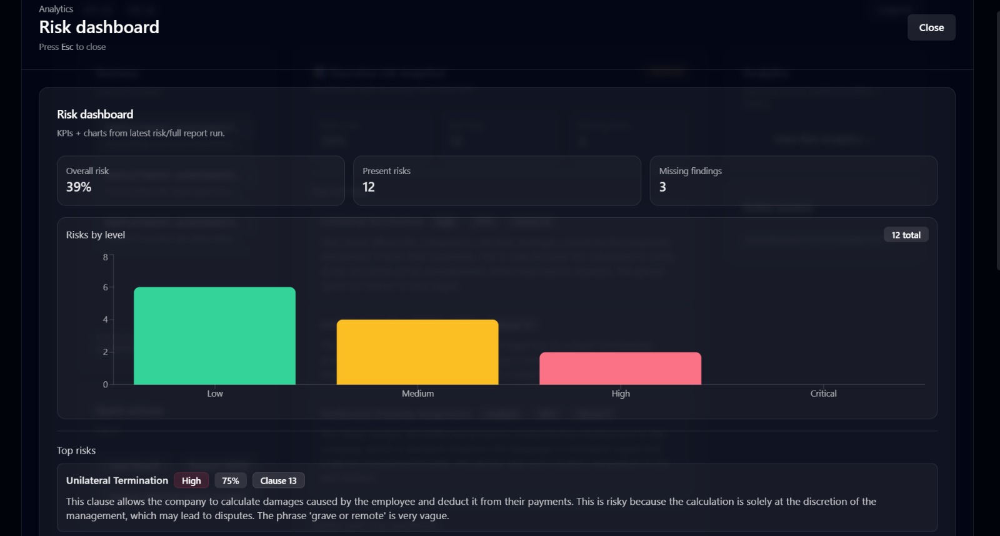

# 🚀 ClauseWise
### Agentic AI for Contract Intelligence & Risk Insight

**ClauseWise** is a production-deployed, full-stack contract intelligence system built using an **Agentic AI architecture** (Planner → Executor → Tools). It enables professionals, legal teams, and startups to analyze contracts, extract key clauses, detect legal risks, and generate structured legal reports with evidence-backed citations.

---

## 🌐 Live Demo

* **Frontend:** [contract-analyzer-bay.vercel.app](https://contract-analyzer-bay.vercel.app)
* **Backend API Docs (Swagger):** [contract-analyzer-3lft.onrender.com/docs](https://contract-analyzer-3lft.onrender.com/docs)

---

## 🎥 Product Demo

Watch the 5-minute demo of ClauseWise in action:

👉 [Watch Demo Video](https://www.loom.com/share/459fb9101dbe4cbf849e394c346b7578)

---

## Screenshots Demo








## Example Output

Query:
"Can i terminate early?"

Answer:
Notice / resignation related clause:

This Employment Agreement shall continue until te rminated by either Party as provided herein
and supersedes any and all prior oral or written agreement s pertaining to the duration,
Notice Period.
completion of two years, then he/she is liable to pa y penalty equal to Rs. 2 lakhs. Since the
Employer’s company is a software developing company as well a s a reputed Training Academy
that enjoys tremendous goodwill in the market. Since, a lot of time, energy and effort is devoted
talent in them and nurturing them to make them able, competent and successful professionals.
meet the performance criteria prescribed by the Company.
made available to him/her during the term of this Emplo yment Agreement concerning or in any
way relating to the business or affairs of the Company , its subsidiaries, divisions, affiliates, or
clients shall be the Company ’s property and shall be delivered to the Company on th e
termination of this Employment Agreement or at any other time at the request of the Company.
company or with the customer outside the course of emp loyment, the company shall not be
responsible for it in any circumstances.
as a result of which the company suffers huge loss, in case of such an event, the Employer shall
instituting legal / court proceedings.
tenure.

## 🧠 What Makes ClauseWise Different?

Unlike traditional contract tools, ClauseWise is built as a true **Agentic AI System**, not just a single prompt wrapper.

* **🔹 Planner Agent:** Determines intent & tool routing.
* **🔹 Executor Agent:** Executes structured tool steps.
* **🔹 FAISS RAG:** Semantic clause retrieval for high accuracy.
* **🔹 Hybrid Risk Engine:** Vector retrieval + rule logic + LLM validation.
* **🔹 Confidence Scoring:** Transparency through retrieval strength & risk weighting.
* **🔹 Evidence-Based:** Always provides direct clause citations.

---

## Key Features

- Contract summarization using LLM reasoning
- Key clause extraction
- Risk and red-flag detection
- Missing clause identification
- Lawyer question generation
- Evidence-backed clause citations
- Executive risk dashboard
- Full report PDF export

## 🏗 System Architecture


```text
Frontend (React + Vite)
        │
        │  Axios API Calls (JWT)
        ▼
Backend (FastAPI)
        │
        ├── Auth Layer (JWT)
        ├── Planner Agent
        ├── Executor Agent
        │       ├── Summary Engine
        │       ├── Key Clause Extractor
        │       ├── Structured Analyzer
        │       ├── Hybrid Risk Engine
        │       └── Lawyer Question Generator
        │
        ├── FAISS Vector Store
        ├── SentenceTransformer Embeddings
        ├── PostgreSQL Persistence
        │
        ▼
Google Gemini (LLM)
```

## 📂 Folder Structure

```text
agents/    → Planner & Executor agent logic
api/       → FastAPI routes, JWT auth, and DB models
rag/       → Vector store and contract indexing logic
tools/     → Specialized analysis and extraction engines
frontend/  → React application (Vite + Tailwind)
data/      → Local storage for contracts and FAISS indexes
```

## 🛠 Tech Stack
### **Backend**
* 🔹 **Framework:** FastAPI, PostgreSQL, SQLAlchemy
* 🔹 **Vector Engine:** FAISS, SentenceTransformers (`all-MiniLM-L6-v2`)
* 🔹 **Intelligence:** Google Gemini API (LLM)
* 🔹 **Security:** JWT Authentication
* 🔹 **Deployment:** Render

### **Frontend**
* 🔹 **Core:** React (Vite), Axios
* 🔹 **Styling:** Tailwind CSS, `shadcn/ui` Components
* 🔹 **Features:** Risk Analytics Dashboard
* 🔹 **Deployment:** Vercel

---

## ⚡ Performance & Security

* 🚀 **Optimized Performance:** Uses background contract indexing and cached embedding models to minimize latency.
* 📊 **Confidence Scoring:** Derived from FAISS L2 distance, similarity weighting, and risk severity multipliers.
* 📜 **Auditability:** Every query stores the full **Query → Plan → Result** pipeline for reproducibility.
* 🔐 **Security:** Stateless JWT authentication with user-scoped data isolation and CORS protection.

---

## 🎯 Target Users & Use Cases

* ⚖️ **Legal Teams:** Rapid first-pass review and risk assessment.
* 🚀 **Founders:** Understanding NDAs, Service Agreements, and Term Sheets.
* 💼 **HR & Employees:** Evaluating offer letters and non-compete clauses.
* 🛠 **Compliance:** Auditing contracts for missing regulatory language.

**Example Queries:**
> * "Can I terminate this agreement early?"
> * "Is there a penalty clause for late delivery?"
> * "Are my IP rights fully assigned to the company?"
> * "Generate a full executive risk report for this contract."

---

## 🏆 Why ClauseWise?

* ✅ **Production-Ready:** Fully deployed and functional on Render and Vercel.
* ✅ **True Agentic Flow:** Uses a Planner/Executor model rather than basic RAG.
* ✅ **Grounded in Reality:** Every claim is backed by a direct citation from the source file.
* ✅ **Full Stack:** A complete end-to-end implementation from DB to Dashboard.

---

## 📌 Future Improvements

-  **Async Job Queues:** Implementing Celery/Redis for massive file batches.
- **GPU Acceleration:** Faster embedding generation for high-traffic environments.
- **Contract Diffing:** Multi-contract comparison and version analysis.
- **Automated Redlining:** AI-suggested clause modifications and legal improvements.

---

## 👨‍💻 Author

**Tarun S**
- *BE CSE*
- *Agentic AI & ML Enthusiast*